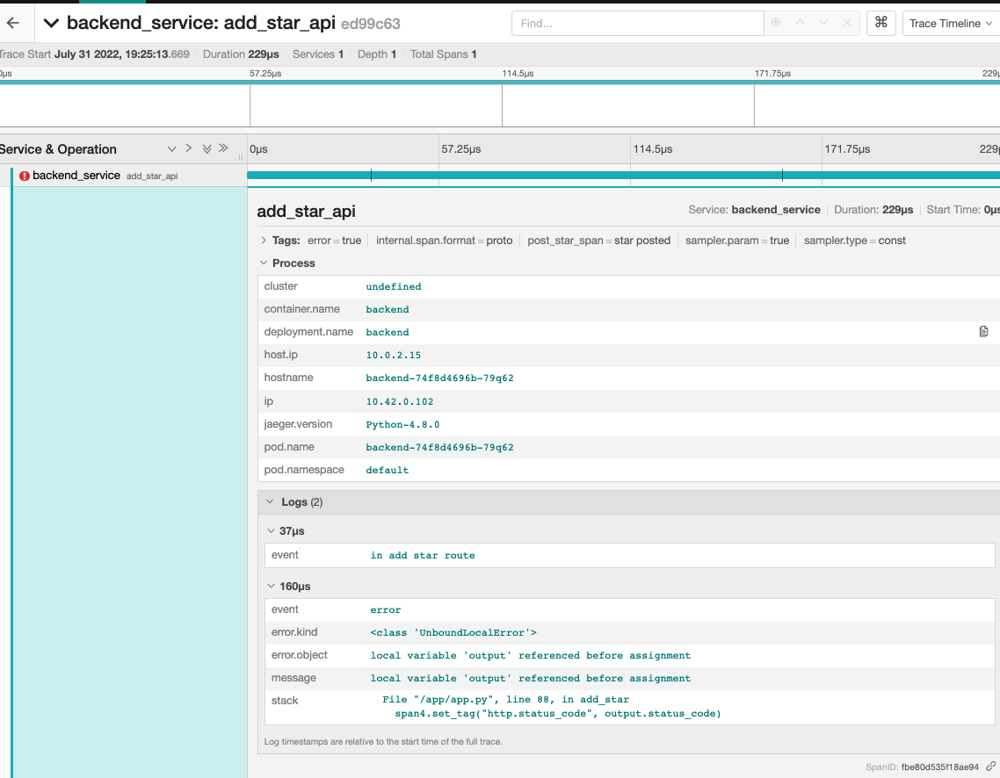
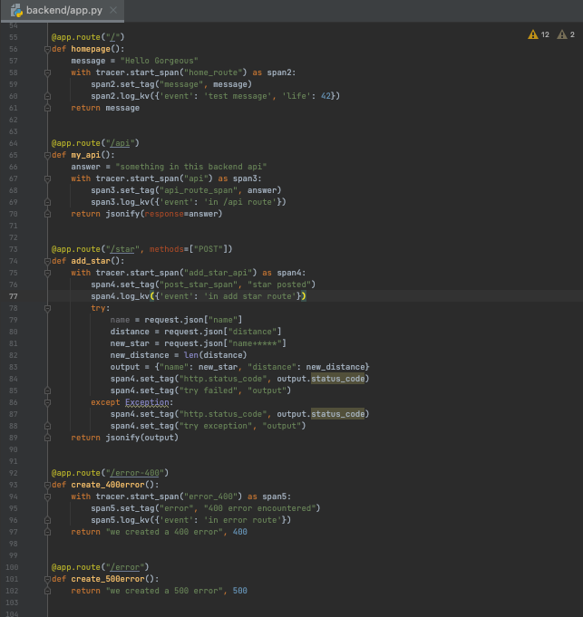

# Cloud Native Metrics
## Overview
In this project, you will create dashboards that use multiple graphs to monitor our sample application that is deployed on a Kubernetes cluster. You will be using Prometheus, Jaeger, and Grafana in order to monitor, trace and visualize your experience.

**Note:** For the screenshots, you can store all of your answer images in the `answer-img` directory.

## Verify the monitoring installation
run `kubectl get all -A` command to show the running pods and services for all components. Take a screenshot of the output and include it here to verify the installation

## Setup the Jaeger and Prometheus source
Expose Grafana to the internet and then setup Prometheus as a data source. Provide a screenshot of the home page after logging into Grafana.

## Create a Basic Dashboard
Create a dashboard in Grafana that shows Prometheus as a source. Take a screenshot and include it here.

## Describe SLO/SLI
Describe, in your own words, what the SLIs are, based on an SLO of *monthly uptime* and *request response time*.

`monthly uptime` prometheus stores a an `up` metric with the value `1` when the instance of the pod is healthy or `0` when it fails. We could measure this metric over a 30 day period

`request response time` 95% percent of requests responses take less than 5 seconds to complete. 

## Creating SLI metrics. 
It is important to know why we want to measure certain metrics for our customer. Describe in detail 5 metrics to measure these SLIs. 

####  Uptime: 
- the total time the application is available to serve requests
- Example: Site should be up for 99.95% over a 30 day period.
- Why? Poor uptime percentages could result in financial penalties and could violate any SLAs we have or could cause reputational damage and limit confidence in our digital product offering.

#### Latency:
- the time it takes to serve a request
- Example: web requests should be served 99% of time under 500ms
- Why? We want to ensure that we are able to serve the traffic that goes to our website, both from a frontend and backend perspective and that there are no bottlenecks in any layers of our service

#### Traffic:
- total number of requests to hit our site across the network during a given time period
- Example: hourly unique visitors to reach 
- Why? We want to ensure we have an SLI that measures how much our site is visited and that we can handle demand 

#### Errors:
- the number of requests that fail
- Example: 4xx, 5xx errors that appear in our system within a given time period
- Why? We want to ensure we keep quality of our errors to an acceptable rate. An increase an errors post release could signal proactively an issue with a recent release. High increase in errors could have a negative impact to traffic overtime

#### Saturation:
- CPU usage or memory usage
- Example: CPU usage during peak traffic hours
- Why? The amount of work or strain your infrastructure has to do to support your product. Depending on how the service is performing you require changes to correctly scale or satisfy bursts in traffic. 100% utilization can be a sign of bottleneck that could impact other SLIs such as response times and latency

## Create a Dashboard to measure our SLIs
Create a dashboard to measure the uptime of the frontend and backend services 
We will also want to measure to measure 40x and 50x errors. 
Create a dashboard that show these values over a 24 hour period and take a screenshot.

## Tracing our Flask App
 We will create a Jaeger span to measure the processes on the backend. Once you fill in the span, provide a screenshot of it here. Also provide a (screenshot) sample Python file containing a trace and span code used to perform Jaeger traces on the backend service.
 
 

## Jaeger in Dashboards
*TODO:* Now that the trace is running, let's add the metric to our current Grafana dashboard. 
Once this is completed, provide a screenshot of it here.

## Report Error
*TODO:* Using the template below, write a trouble ticket for the developers, 
to explain the errors that you are seeing (400, 500, latency) and to let them 
know the file that is causing the issue also include a screenshot of the tracer span to 
demonstrate how we can user a tracer to locate errors easily.

TROUBLE TICKET

Name:

Date:

Subject:

Affected Area:

Severity:

Description:

## Creating SLIs and SLOs
*TODO:* We want to create an SLO guaranteeing that our application has a 99.95% uptime per month. 
Name four SLIs that you would use to measure the success of this SLO.

## Building KPIs for our plan
*TODO*: Now that we have our SLIs and SLOs, create a list of 2-3 KPIs to accurately measure these metrics 
as well as a description of why those KPIs were chosen. We will make a dashboard for this, but first write them down here.

## Final Dashboard
*TODO*: Create a Dashboard containing graphs that capture all the metrics of your KPIs 
and adequately representing your SLIs and SLOs. Include a screenshot of the dashboard here,
and write a text description of what graphs are represented in the dashboard.  

##Project Background
### Technologies
* [Vagrant](https://www.vagrantup.com/) - Tool for managing virtual deployed environments
* [VirtualBox](https://www.virtualbox.org/) - Hypervisor allowing you to run multiple operating systems
* [K3s](https://k3s.io/) - Lightweight distribution of K8s to easily develop against a local cluster
* [Jaeger](https://github.com/jaegertracing/jaeger-operator/) - Jaeger Operator
* [Prometheus](https://prometheus.io/) - Prometheus
* [Grafana](https://grafana.com/) - Grafana

###Prerequisites
We will be installing the tools that we'll need to use for getting our environment set up properly.
1. [Install Docker](https://docs.docker.com/get-docker/)
2. [Set up a DockerHub account](https://hub.docker.com/)
3. [Set up `kubectl`](https://rancher.com/docs/rancher/v2.x/en/cluster-admin/cluster-access/kubectl/)
4. [Install VirtualBox](https://www.virtualbox.org/wiki/Downloads) with at least version 6.0
5. [Install Vagrant](https://www.vagrantup.com/docs/installation) with at least version 2.0

##Steps
1. Install Helm and use it to install Prometheus and Grafana
   [helm-installation](https://helm.sh/docs/intro/install/#from-script)
2. Install Jaeger
   `kubectl create namespace observability`
   `kubectl create -f https://raw.githubusercontent.com/jaegertracing/jaeger-operator/${jaeger_version}/deploy/crds/jaegertracing.io_jaegers_crd.yaml`
   `kubectl create -n observability -f https://raw.githubusercontent.com/jaegertracing/jaeger-operator/${jaeger_version}/deploy/service_account.yaml`
   `kubectl create -n observability -f https://raw.githubusercontent.com/jaegertracing/jaeger-operator/${jaeger_version}/deploy/role.yaml`
   `kubectl create -n observability -f https://raw.githubusercontent.com/jaegertracing/jaeger-operator/${jaeger_version}/deploy/role_binding.yaml`
   `kubectl create -n observability -f https://raw.githubusercontent.com/jaegertracing/jaeger-operator/${jaeger_version}/deploy/operator.yaml`
3. Grant Jaeger cluster wide visibility
   `kubectl create -f https://raw.githubusercontent.com/jaegertracing/jaeger-operator/${jaeger_version}/deploy/cluster_role.yaml`
   `kubectl create -f https://raw.githubusercontent.com/jaegertracing/jaeger-operator/${jaeger_version}/deploy/cluster_role_binding.yaml`
4. Install the Python application, navigate to manifests/app
   `kubectl apply -f backend.yaml`
   `kubectl apply -f frontend.yaml`
5. Expose Grafana
   `kubectl get pod -n monitoring | grep grafana`copy the `prometheus-grafana-######`
   `kubectl port-forward -n monitoring prometheus-grafana-7b574fc5b9-89ltk  3000`
    [frontend](http://localhost:3000), login with username:admin, password: prom-operator
6. Expose Python Application, Frontend and Backend
   `kubectl port-forward svc/frontend 8080:8080`
   `kubectl port-forward svc/backend 8081:8081` (make sure the ports match what is in your vagrant file and in your yaml deployment)
    [backend](http://localhost:8080)
   `for i in 0 1 2 3 4 5 6 7 8 9; do curl localhost:8081; done`
7. Checkout prometheus if you want
    `kubectl port-forward -n monitoring service/prometheus-kube-prometheus-prometheus 9090:9090`
   